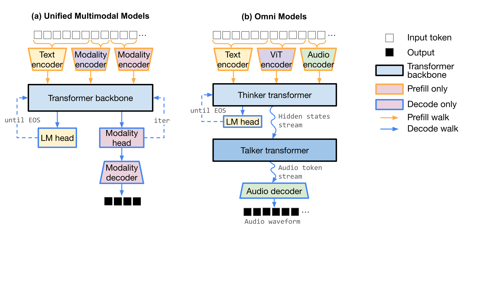
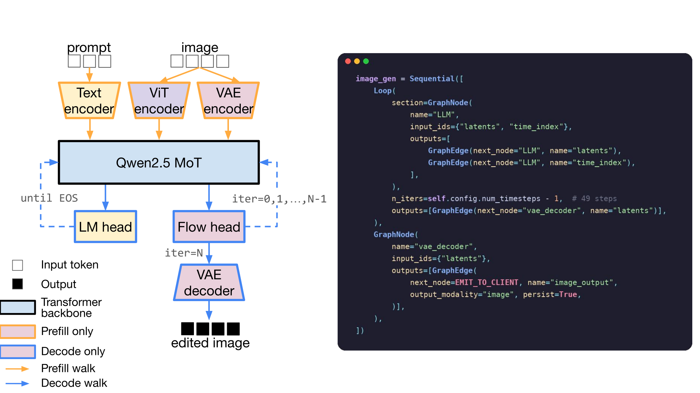
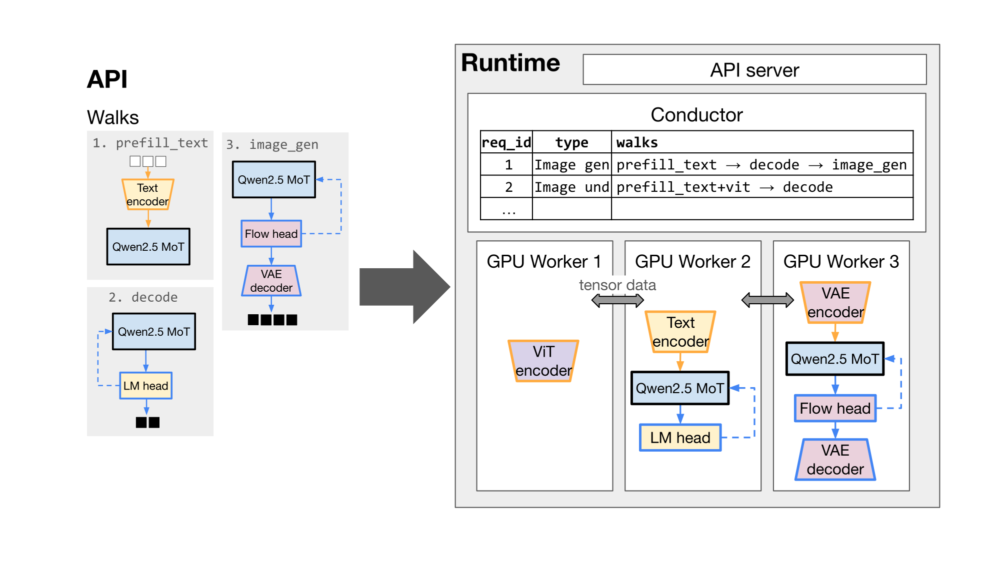
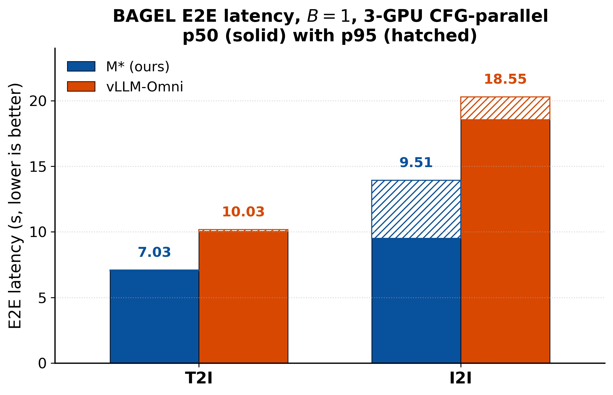
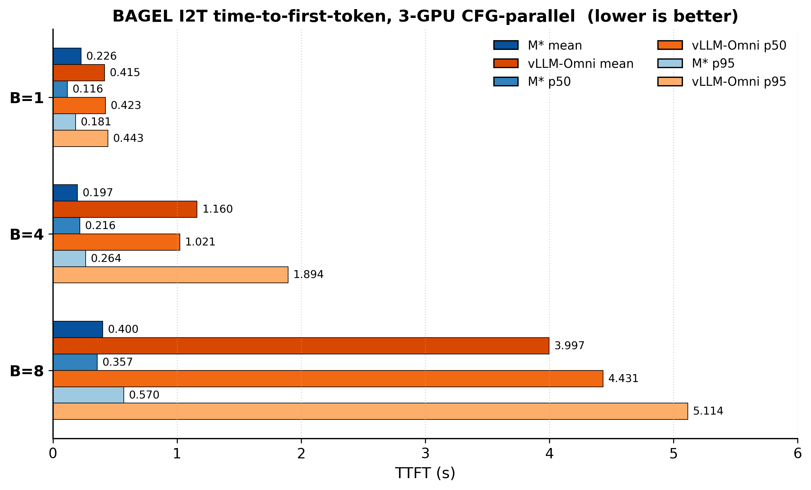
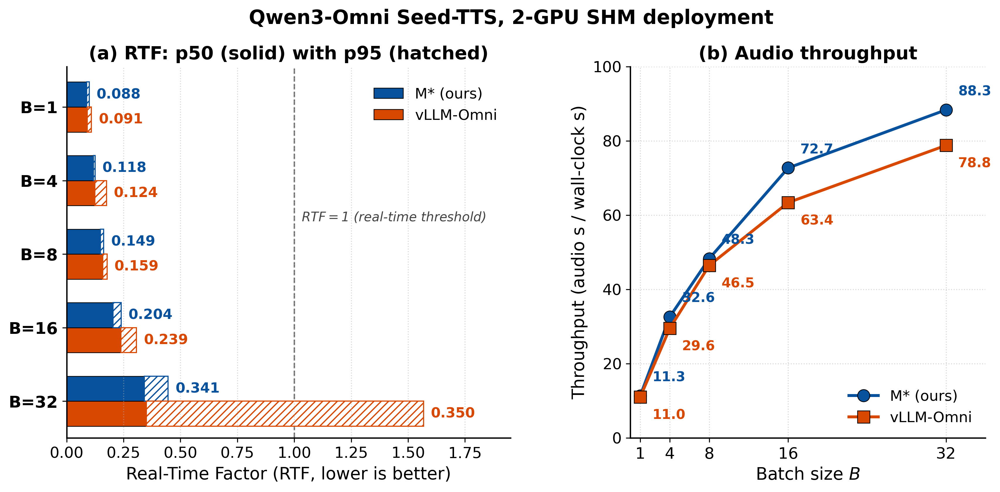
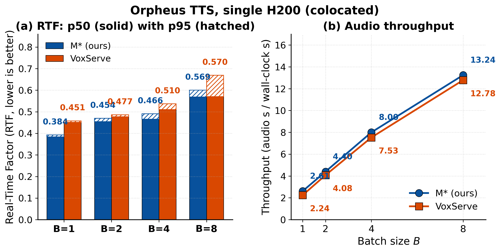
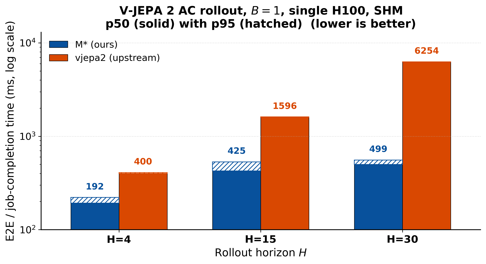

# M\*: A Modular, Extensible, Serving System for Multimodal Models

*Composite models broke the single-loop assumption behind LLM serving. **Models are graphs; requests are
Walks.** M\* is built on exactly that.*

> **Syndication copy.** This Markdown mirrors the canonical post at the M\* website (which has the
> interactive, animated diagrams). When posting to SNAP / SAIL·HAI / UW SyFI, upload the images from
> `assets/img/` and fix the relative paths to match your CMS, and add a `rel="canonical"` link back to the
> M\* website. Numbers and figures are **preliminary** pending the public-release benchmark rerun.

*Atindra Jha, Naomi Sagan, Keisuke Kamahori, Irmak Sivgin, Rohan Sanda, Steven Gao, Mark Horowitz, Luke Zettlemoyer, Olivia Hsu, Jure Leskovec, Stephanie Wang, Baris Kasikci*

*Stanford University · University of Washington · Correspondence: [atindra@cs.stanford.edu](mailto:atindra@cs.stanford.edu)*

**[Read the paper (arXiv)](https://arxiv.org/abs/XXXX.XXXXX) · [Code (GitHub)](https://github.com/your-org/mminf) · [Docs](#)**

---

## Inference is no longer a single loop

We have entered an era of **composite model architectures**: models built from structurally distinct
components — vision encoders, transformer backbones, diffusion and flow heads, audio codecs, action
generators, world-model predictors — composed and executed in patterns that change with the input and the
task. Across all of them, one assumption no longer holds: *that inference is a single autoregressive
loop* — prefill the prompt, then decode one token at a time until the model stops.

Five families make this concrete, and each bends the execution shape differently: **UMMs** (BAGEL),
**SpeechLMs** (Orpheus), **Omni** models (Qwen3-Omni), **VLAs** (π0.5), and **world models** (V-JEPA 2).
Modern models add **non-AR loops** (diffusion / rectified-flow image generation, variable-horizon
world-model rollouts), **internal parallelism** (the conditional branches of classifier-free guidance; the
pipelined Thinker–Talker of an omni model), and **input-dependent paths** (in BAGEL, image *generation* and
image *understanding* traverse different components of the *same* model).


*Figure 1. Example architectures — a UMM (BAGEL) and an Omni model (Qwen3-Omni). Structurally diverse, yet
each is naturally a graph of components.*

## Why today's serving stacks fall short

Composite models pose three challenges at once: **architectural diversity** (many paths, non-AR loops),
**performant modularity** (HuggingFace Transformers is flexible but slow; vLLM and VoxServe are fast but
domain-locked), and **physical topology** (heterogeneous components want different placement, batching, and
transport).

**vLLM and SGLang** are superb at autoregressive text generation, but they treat multimodal inputs as
prefill-time encoder add-ons: an encoder runs, its embeddings are spliced into the token stream, and a
single decode loop produces the output — which is always text. They have no first-class way to compose
heterogeneous components into loops and parallel branches, no branch parallelism such as CFG fan-out, and no
cross-component streaming. **vLLM-Omni and SGLang-Omni** go further, modeling a request as a flat pipeline
of stages wired by explicit data-transfer functions — enough for a Thinker–Talker–codec chain. But
iteration stays inside a single stage, stages can't be composed in parallel, and resources are assigned per
whole stage. The patterns composite models actually need — diffusion loops, CFG fan-out, custom
cross-component streaming — come back as per-model glue code (in vLLM-Omni, for instance, BAGEL's CFG runs
through a bespoke plugin built on `torch.distributed`).

| | vLLM-Omni | SGLang-Omni | **M\* (ours)** |
|---|---|---|---|
| Graph node | Engine-instance stage | Worker-pool stage | **Model component** |
| Composition | Flat DAG | Flat DAG | **Seq. / Par. / Loop / Stream** |
| Paths per model | Prefill, decode | Prefill, decode | **Flexible** |
| Loops | Within a stage | Within a stage | **Across any subgraph** |
| Placement | Stage | Stage | **Component, w/ optional Walk** |

*Table 1. Each prior abstraction is a restricted subset of the Walk Graph.*

## Models are graphs, requests are Walks

M\* is built on a single contract. A model is declared as a tuple **(G, W)**: a directed computation graph
`G = (N, E)` of component **nodes** and tensor **edges**, plus a finite set of named **Walks** `W` — each a
labeled subgraph for one phase of behavior (`prefill_text`, `decode`, `image_gen`). A request is a *series
of Walks*, chosen by a small state machine the model author provides. Image understanding, for instance, is
`[prefill_text → prefill_vit → decode]`.

The author writes only **(G, W)** and that state machine. Everything physical — placement, scheduling,
batching, tensor transport, streaming — is the runtime's job. Graphs are built from four composable
primitives: **Sequential**, **Parallel**, **Loop**, and **DynamicLoop** (a Loop with per-request early
exit — EOS for AR, rollout horizon for world models). Streaming uses a `StreamingGraphEdge` parameterized
by a `ChunkPolicy` (fixed, sliding-window, or left-context).

Here is BAGEL's image-generation Walk in M\*'s graph DSL — a `Loop` of flow steps over the `LLM` node
feeding a terminal `vae_decoder`. It reads like a description of the model, because that is what it is:

```python
# Simplified, non-CFG image-generation Walk for BAGEL
image_gen = Sequential([
    Loop(section=GraphNode(name="LLM", input_ids={"latents", "time_index"},
                           outputs=[GraphEdge(next_node="LLM", name="latents"),
                                    GraphEdge(next_node="LLM", name="time_index")]),
         n_iters=49, outputs=[GraphEdge(next_node="vae_decoder", name="latents")]),
    GraphNode(name="vae_decoder", input_ids={"latents"},
              outputs=[GraphEdge(next_node=EMIT_TO_CLIENT, name="image_output")]),
])
```


*Figure 2. BAGEL in M\*: seven nodes (`vit_encoder, vae_encoder, LLM, LLM_cfg_text, LLM_cfg_img,
combine_cfg, vae_decoder`) and six Walks across them.*

## What the Walk Graph unlocks

Decoupling the model from the runtime is where the performance comes from:

- **Modality-aware scheduling** — run *only the components a request needs*; never the diffusion path for a
  text answer.
- **Flexible parallelism** — express parallelism *in the graph* with `Parallel` (e.g. the three CFG
  branches); the runtime executes it uniformly.
- **Flexible placement** — map each node to GPU rank(s): disaggregation, prefill/decode split, independent
  scaling, transparent multiplexing of one replica across Walks.
- **Loop optimizations** — CUDA graphs and continuous batching stay *agnostic to loops*; the scheduler can
  interleave flow steps with AR decode on the shared backbone.
- **Flexible streaming** — one `ChunkPolicy` interface covers every streaming edge in our evaluation.
- **Sharding × disaggregation** — tensor-parallel sharding composes with component disaggregation (below).

Classifier-free guidance needs three forward passes per denoising step. In M\* that is just a `Parallel`
block of three branches that merge at `combine_cfg` and loop — one GPU per branch if you want, with no
runtime glue:

```python
# The full CFG Walk — three branches in Parallel, one rank each
image_gen_cfg = Sequential([
    Loop(section=Sequential([
        Parallel([                                # 3-branch CFG, 1 branch per GPU
            Node("LLM",          [latents, t], [Edge("combine_cfg", "v_main")]),
            Node("LLM_cfg_text", [latents, t], [Edge("combine_cfg", "v_text")]),
            Node("LLM_cfg_img",  [latents, t], [Edge("combine_cfg", "v_img")]),
        ]),
        Node("combine_cfg", [v_main, v_text, v_img],      # CFG formula + Euler step
             [Edge("LLM", "latents"), Edge("LLM_cfg_text", "latents"), Edge("LLM_cfg_img", "latents")]),
    ]), n_iters=50),
    Node("vae_decoder", [latents], [Edge(EMIT_TO_CLIENT, "image_output")]),
])
```

## A real runtime, not a toy DSL

An HTTP server accepts requests. A **Conductor** (one per server) keeps each request's Walk state and
dispatches work to **Workers** (one process per GPU rank) over ZeroMQ; workers route tensors directly to
downstream workers. The data plane is pluggable — shared memory, RDMA, and TCP via Mooncake. Each node runs
on an **engine**: the workhorse **AREngine** (a modality-agnostic transformer with FlashInfer
paged-attention KV cache), plus simpler encoder/decoder and audio-codec engines for stateless nodes. All
engines support continuous batching and CUDA-graph replay, and the runtime overlaps scheduling with GPU
execution by building the next attention plan on a separate stream while the current step runs.


*Figure 3. M\* at a glance. The author defines a computation graph and a set of Walks (left); the runtime
places component subgraphs on GPU workers per a user-specified placement (right).*

> **New: sharding × disaggregation.** M\* supports **tensor-parallel sharding** — the infrastructure to
> split a single large component across multiple GPUs is built in (parallel linears, vocab-parallel
> embeddings, sharded MoE and KV cache, NCCL collectives), configured with a simple `tp_size` in the
> placement file. The superpower is **composition**: sharding and granular disaggregation are the same
> placement API, so you can tensor-parallel-shard a large **Qwen3-Omni** backbone across GPUs *while*
> disaggregating its encoders and codec elsewhere. One large component fitting on one GPU is no longer a
> constraint.

## Does it work? — Matching or beating specialized systems

> **Preliminary.** Numbers below are from an early benchmark run and will be refreshed for the public
> release; treat them as directional.

We instantiate M\* on five real models and compare against the right baseline for each.

| Model · task | Baseline | Setup | Headline result |
|---|---|---|---|
| BAGEL · text→image | vLLM-Omni | 3×H100, CFG-parallel, B=1 | **1.43× lower p50 E2E latency (≈30%)** |
| BAGEL · image editing | vLLM-Omni | 3×H100, CFG-parallel, B=1 | **1.95× lower p50 E2E latency (≈50%)** |
| BAGEL · image→text | vLLM-Omni | 1×H100, B≤8 | **up to 12.1× throughput · 11.5× lower TTFT** |
| Qwen3-Omni · TTS | vLLM-Omni | 2×H200 | **stays real-time at B=32 (p95 RTF 0.45 vs 1.57) · +15% throughput** |
| Orpheus · TTS | VoxServe | 1×H200 | **15% lower RTF (B=1) · tighter p95 tail** |
| V-JEPA 2 · rollout | Meta native | 1×H100 | **up to 12.5× faster (H=30)** |

The story behind the numbers is the abstraction: M\* runs *only the components a request needs* (image
understanding never touches the diffusion path), expresses *internal parallelism* as a primitive (CFG), and
makes *loops first-class with KV caching* (the world-model rollout that the baseline recomputes from scratch
each step).


*Preliminary — BAGEL T2I/I2I end-to-end latency, 3×H100, CFG-parallel, B=1. Lower is better.*


*Preliminary — BAGEL I2T time-to-first-token, 1×H100, B∈{1,4,8} (log scale). Lower is better.*


*Preliminary — Qwen3-Omni (Seed-TTS), 2×H200: RTF (lower better) and audio throughput (higher better).*


*Preliminary — Orpheus-TTS, 1×H200: RTF and audio throughput vs VoxServe.*


*Preliminary — V-JEPA 2-AC rollout, 1×H100, B=1, horizons H∈{4,15,30}. Lower is better.*

## Coming soon

- **More models, day-zero** — more UMMs and omni models (Show-o2, Janus-Pro, Qwen2.5-Omni are design
  targets), plus more VLAs and world models, onboarded by writing a Walk Graph.
- **Sharding everywhere** — tensor-parallel sharding is live today; rolling out across more model families.
- **More parallelism strategies** — sequence/context and DiT-specific parallelism via the same placement API.
- **Unified engine plugins** — converging the AR, encoder/decoder, and audio-codec engines behind one
  interface.
- **A friendlier front door** — an OpenAI-compatible API, a Python SDK, and a one-command quickstart.
- **Docs & recipes** — install, configs, placement cookbooks, and "write a Walk Graph for your model."

## Get started

```bash
# serve any supported model from a placement config
mminf-serve --config configs/bagel.yaml --host 0.0.0.0 --port 8000

# text in, text out
curl -X POST http://localhost:8000/generate -F 'text=Hello, how are you?'

# text in, image out
curl -X POST http://localhost:8000/generate \
     -F 'text=a red panda sipping tea' -F 'output_modalities=image'
```

Placement is just configuration — logical nodes are decoupled from physical GPUs:

```yaml
model: "bagel"
node_groups:
  - { node_names: [vit_encoder], ranks: [0] }
  - { node_names: [vae_encoder, vae_decoder], ranks: [0] }
  - { node_names: [LLM], ranks: [1] }
```

**[Read the paper (arXiv)](https://arxiv.org/abs/XXXX.XXXXX) · [Code (GitHub)](https://github.com/your-org/mminf) · [Docs](#)**

```bibtex
@inproceedings{mstar2026,
  title     = {M*: A Modular, Extensible, Serving System for Multimodal Models},
  author    = {Atindra Jha and Naomi Sagan and Keisuke Kamahori and Irmak Sivgin and
               Rohan Sanda and Steven Gao and Mark Horowitz and Luke Zettlemoyer and
               Olivia Hsu and Jure Leskovec and Stephanie Wang and Baris Kasikci},
  year      = {2026},
  note      = {Preprint}
}
```
